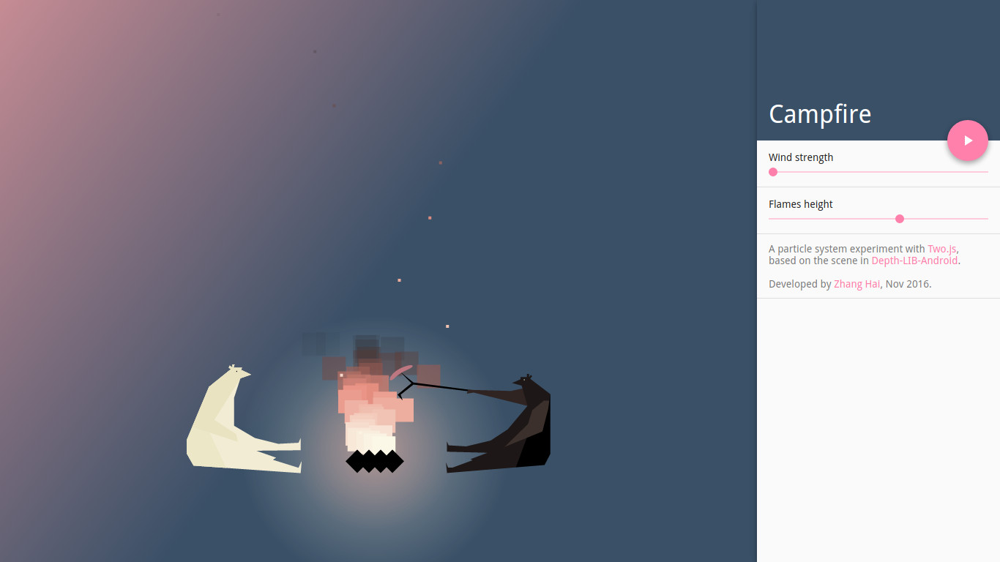

# Campfire

https://zhanghai.github.io/particle-system-campfire/

A particle system experiment with [Two.js](https://two.js.org/), based on the scene in [Depth-LIB-Android](https://github.com/danielzeller/Depth-LIB-Android-).

Developed by [Zhang Hai](http://www.zhanghai.me/), Nov 2016.
